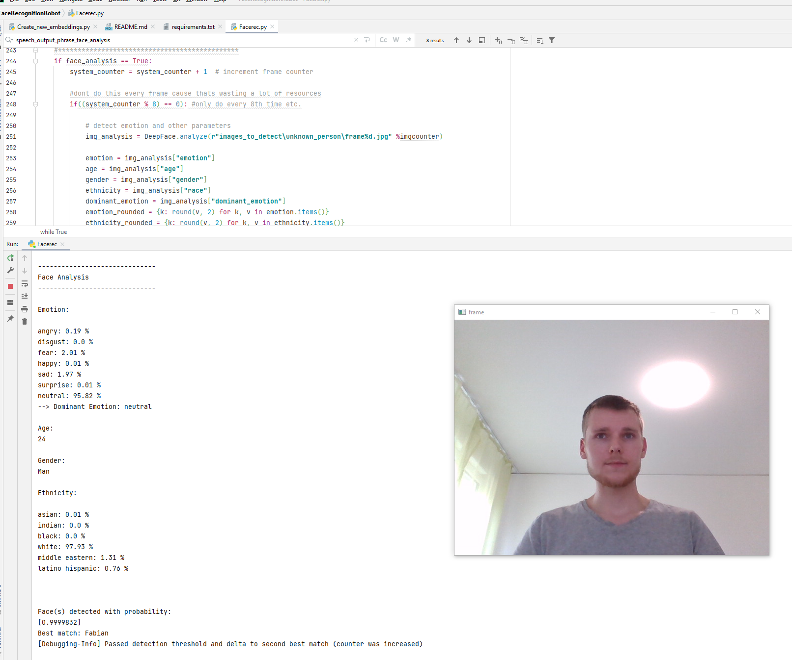

# FaceRecognitionRobot 
This university project features face detection, face recognition and face analysis including emotion detection for a robot, but can also be used locally on a computer.
It also features a Text-to-Speech output. Furthermore it features multiple face detection.




## Instructions
Learning procedure: 
If there are people that should be detected, 
simply add a new folder of their name and some pictures of them inside the folder "data/known_persons".
Everytime when the list of people is extended or changed, 
run "Create_new_embeddings.py". 
Make sure there are no umlauts used for the names.

Run "Facerec.py" in order to run the detection program itself.

For more information see project documentation file (.docx) which is not availabe here on GitHub.

## Installation
Python 3.7.x is recommended (It works on 3.7.6 and 3.7.9 for sure). 
The required packages for facenet-pytorch and Deepface might conflict! Make sure to have following versions of packages:
- facenet-pytorch 2.5.2
- mtcnn 0.1.0
- opencv-python 4.4.0.44
- torch 1.8.1
- torchvision 0.9.1
- tensorflow 2.3.1
- keras 2.4.3
- deepface 0.0.51

With that combination it works. See more in requirements.txt.

In case it still doesn't work, please read the error messages. 
They might be an error that you can fix in a dirty way via replacing
```
from keras.layers import Input, Dense, Conv2D, MaxPooling2D, PReLU, Flatten, Softmax
from keras.models import Model
```
by
```
from tensorflow.keras.layers import Input, Dense, Conv2D, MaxPooling2D, PReLU, Flatten, Softmax
from tensorflow.keras.models import Model
```
inside factory.py inside mtcnn folder.

For the package pyttsx3 you need the version 2.6 or 2.9.0, newer versions might not work.

Please be aware of the fact that on the first run after installation, the algorithm will stuck once because it will download the deepface model after first usage by default.
After this first start, it will run fluently again.

## Preventing image normalization
By default, the MTCNN module of facenet-pytorch applies fixed image standardization to faces before returning so they are well suited for the package's face recognition model.
If you want to get out images that look more normal to the human eye and not in a dark version, this normalization can be prevented by creating the detector with post_process=False.

## Potential Extensions
- ID Tracking (i.e. tracking after person turns around etc.) --> not necessary in first version since it's not trivial

## Some parameters that can be finetuned for better results
* `similarity_threshold` as threshold for triggering face recognition success
* `delta_first_secon_bestmatch` as a value to make sure there is a sufficient difference between the best and the second best match (person)
* `frequence_face_analysis`: activate face analysis on every n_th frame
* `time_of_period`: time until values for detected people are resetted

You may also adjust some (hyper)parameters of MTCNN and/or deepface.


## License

For this project we used several python libraries including:

* facenet-pytorch: https://github.com/timesler/facenet-pytorch
* MTCNN: https://github.com/ipazc/mtcnn
* deepface: https://github.com/serengil/deepface
* pyttsx3: https://github.com/nateshmbhat/pyttsx3

Of course, we also use some typical packages such as Pandas, OpenCV etc.