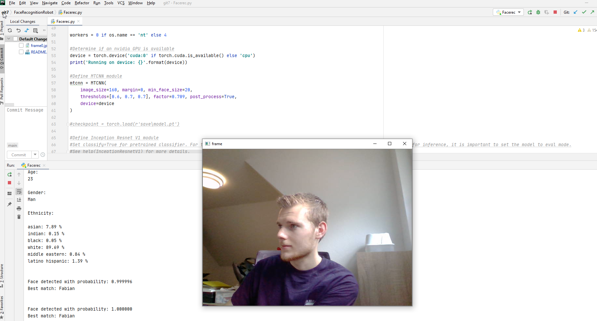

# FaceRecognitionRobot 
This university project features face detection, face recognition and face analysis including emotion detection for a robot, but can also be used locally on a computer.
It also features a Text-to-Speech output.

## Instructions
Learning procedure: If there is new people that should be detected, simply add a new folder of their name and some pictures of them inside the folder "data/known_persons".
Everytime when the list of people is extended or changed, 
run "Create_new_embeddings.py". 

Run "Facerec.py" in order to run the detection program itself.

For more information see project documentation file (.docx).

## Installation
Python 3.7.6 is recommended. 
For the package pyttsx3 you need the version 2.6, newer versions might not work!

## Some Notes
- Identification vs. Verfication
    - Identification: Who is this person?
    - Verification: Is this person who they claim they are?

## To Do's / Potential Extensions
- ID Tracking (i.e. tracking after person turns around etc.) --> not necessary in first version since it's not trivial